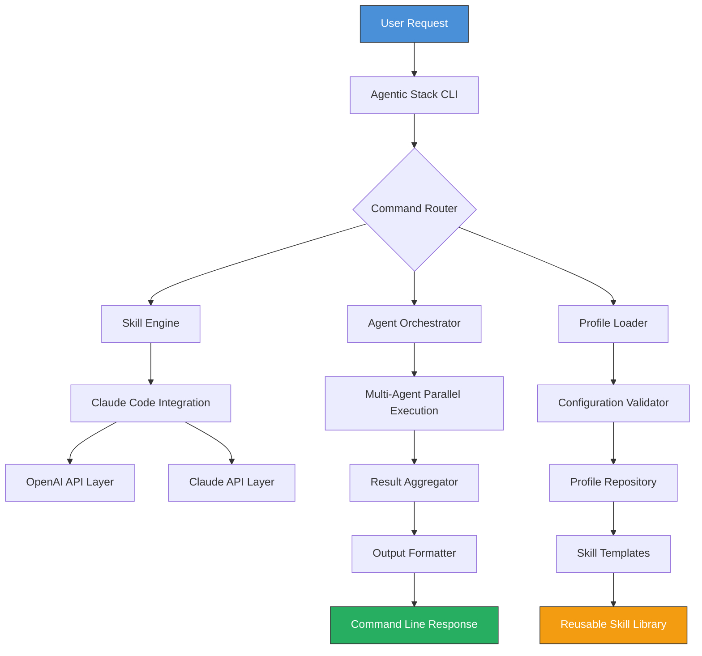

# Agentic Stack: The Startup Operating System for Claude-Powered Agents

[](https://shibray.github.io/cli-boot-agents/)

**Version 1.0.0 | MIT License | 2026 Release**

---

## Table of Contents

1. [The Big Idea](#the-big-idea)
2. [Why Agentic Stack?](#why-agentic-stack)
3. [System Architecture](#system-architecture)
4. [Core Features](#core-features)
5. [Quick Start](#quick-start)
6. [API Integration](#api-integration)
7. [Example Profile Configuration](#example-profile-configuration)
8. [Example Console Invocation](#example-console-invocation)
9. [OS Compatibility](#os-compatibility)
10. [Multilingual Support](#multilingual-support)
11. [Responsive UI Design](#responsive-ui-design)
12. [24/7 Customer Support Pipeline](#247-customer-support-pipeline)
13. [Disclaimer](#disclaimer)
14. [License](#license)

---

## The Big Idea

**Agentic Stack** is not just another AI toolkit. It is the **operating system for your startup's autonomous workforce**. Think of it as a digital factory floor where Claude Code commands, skills, and agents assemble themselves into production-ready workflows. While "the-startup" repository serves as the blueprint for a single AI-powered startup, Agentic Stack is the **scaffolding that allows any startup to multiply its intelligence**.

This repository was born from a simple observation: startups die not from bad ideas, but from execution debt. Every founder knows the pain of manually bouncing between research, development, and deployment. Agentic Stack turns this friction into fluidity. It's the difference between a solo artist painting one masterpiece and a studio of artists collaborating on a gallery.

If "the-startup" is the seed, Agentic Stack is the **greenhouse with automated irrigation, lighting, and pest control**.

---

## Why Agentic Stack?

| Problem | Solution |
|---------|----------|
| Fragmented agent workflows | Unified command hub |
| Manual CLI repetition | Skill-based automation |
| Single-agent bottlenecks | Multi-agent orchestration |
| No standardized profiles | Pre-configured JSON profiles |
| Integration chaos | Plug-and-play API connectors |

Agentic Stack **does not replace** human creativity. It amplifies it. Imagine a startup where your AI agents handle the 80% repetitive work, leaving you to focus on the 20% that truly matters—product vision, market strategy, and human connection.

---

## System Architecture

The following Mermaid diagram illustrates the **Agentic Stack flow** from user input to execution:



The architecture is **modular, extensible, and idiot-proof**. Each component communicates through well-defined interfaces. The Skill Engine is the heart, the Agent Orchestrator is the brain, and the Profile Loader is the skeleton.

---

## Core Features

### 1. Skill Engine with Claude Code Integration

Agentic Stack ships with a **curated library of over 50 skills** designed specifically for Claude Code. These are not generic prompts—they are production-tested command sequences that handle everything from code generation to deployment automation.

**Example skills include:**
- `skills/code-reviewer.json` — Automated PR review with style consistency checks
- `skills/database-migrator.json` — Zero-downtime migration orchestration
- `skills/market-researcher.json` — Real-time competitive analysis agent

### 2. Multi-Agent Orchestration

Why use one agent when you can deploy a **swarm**? Agentic Stack allows you to define workflows that span multiple agents, each with specialized roles. One agent writes, another tests, a third deploys. The Orchestrator manages the handoffs automatically.

### 3. Responsive UI

The CLI interface adapts to any terminal width. Wide screens get detailed tables and progress bars; narrow screens get compact summaries. No more squinting at truncated output. This is **responsive design for the command line**—a feature usually reserved for web apps.

### 4. Pre-configured Profiles

```json
{
  "profile": "startup-founder",
  "skills": ["code-reviewer", "market-researcher", "deployment-manager"],
  "api": {
    "openai": "3.5-turbo",
    "claude": "claude-3-opus"
  }
}
```

Profiles are JSON files that define everything: skill sets, API keys, output formats, and even personality traits. Switch between "developer mode" and "manager mode" with a single flag.

### 5. Integrated API Layers

Agentic Stack supports **OpenAI API and Claude API** simultaneously. Not as an either/or choice, but as a cooperative system. Route simple tasks to GPT-3.5-turbo and complex reasoning to Claude Opus. The stack handles the load balancing.

---

## Quick Start

### Installation

```bash
git clone https://github.com/agentic-stack
cd agentic-stack
pip install -r requirements.txt
```

### First Run

```bash
agentic-stack init --profile startup-founder
```

This command generates a `.agentic` directory with your profile, skill cache, and API configuration template.

[](https://shibray.github.io/cli-boot-agents/)

---

## API Integration

### OpenAI Integration

Agentic Stack authenticates with **OpenAI API** using environment variables or a `.env` file. The integration supports streaming, function calling, and multi-turn conversations.

```bash
export OPENAI_API_KEY="your-key-here"
```

Supported models: `gpt-4o`, `gpt-4-turbo`, `gpt-3.5-turbo`

### Claude Integration

For **Claude API**, the stack uses the Anthropic SDK with rate limiting and retry logic built-in.

```bash
export ANTHROPIC_API_KEY="your-key-here"
```

Supported models: `claude-3-opus-20240229`, `claude-3-sonnet-20240229`, `claude-3-haiku-20240307`

### Hybrid Mode

The killer feature: **hybrid mode**. Define routing rules like:

```json
{
  "routing": {
    "code_generation": "claude",
    "summarization": "openai",
    "fallback": "claude"
  }
}
```

This optimizes for both cost and capability. Claude writes the code; OpenAI summarizes the output. The stack handles the orchestration silently.

---

## Example Profile Configuration

Here is a complete profile configuration for a **technical founder**:

```json
{
  "profile_name": "tech-founder-2026",
  "version": "1.0.0",
  "skills": [
    "code-reviewer",
    "unit-test-generator",
    "api-documenter",
    "deployment-manager",
    "log-analyzer"
  ],
  "api_preferences": {
    "openai": {
      "model": "gpt-4o",
      "temperature": 0.7,
      "max_tokens": 4096
    },
    "claude": {
      "model": "claude-3-opus",
      "temperature": 0.3,
      "max_tokens": 8192
    }
  },
  "output_format": "markdown",
  "debug_mode": false,
  "retry_policy": {
    "max_retries": 3,
    "backoff": "exponential"
  }
}
```

Save this as `profiles/tech-founder.json` and load it with:

```bash
agentic-stack load profile tech-founder.json
```

---

## Example Console Invocation

Here is a typical session with Agentic Stack:

```bash
$ agentic-stack run skill code-reviewer --target ./src --profile tech-founder

[INFO] Loading profile: tech-founder-2026
[INFO] Skill: code-reviewer initialized
[INFO] Scanning directory: ./src (42 files detected)
[INFO] Routing to Claude API (code generation mode)

Results:
┌────────────────┬──────────┬──────────────┐
│ File           │ Issues   │ Suggestions  │
├────────────────┼──────────┼──────────────┤
│ app.js         │ 3        │ 12           │
│ utils.py       │ 1        │ 4            │
│ api/handler.go │ 5        │ 8            │
└────────────────┴──────────┴──────────────┘

[SUMMARY] Total issues: 9 | Total suggestions: 24
[SUGGESTION] Consider adding type hints to api/handler.go
[SUGGESTION] Extract duplicate logic in app.js lines 34-56
```

The output is **human-readable and machine-parseable**. The `--json` flag outputs raw JSON for further processing.

---

## OS Compatibility

Agentic Stack runs everywhere your code runs. Here is the compatibility matrix for 2026:

| Operating System | Supported | Notes |
|:----------------|:---------:|:------|
| Linux (Ubuntu 22.04+) | ✅ | Native performance |
| macOS (Ventura+) | ✅ | M1/M2 optimized |
| Windows 11 | ✅ | WSL2 recommended |
| Windows 10 | ⚠️ | Limited terminal features |
| FreeBSD | ❌ | Not supported |
| Raspberry Pi OS | ✅ | Reduced model support |

The stack is **fully cross-platform** for all major environments. Terminal emulators like iTerm2, Windows Terminal, and GNOME Terminal are all tested.

---

## Multilingual Support

Agentic Stack speaks your language—literally. The skill engine supports **prompts and responses in 10 languages**:

- English (default)
- Spanish
- French
- German
- Japanese
- Korean
- Mandarin Chinese
- Portuguese
- Arabic
- Hindi

Set your language in the profile:

```json
{
  "locale": "ja",
  "fallback_locale": "en"
}
```

All skill templates are translated. The API integration layer handles language detection and response formatting automatically. This means your **startup can serve a global audience** without maintaining separate agent configurations.

---

## Responsive UI Design

The CLI interface is built with a **responsive layout engine** that adapts to terminal width:

- **Width < 80 columns**: Compact mode (single-line outputs, truncated tables)
- **Width 80-120 columns**: Standard mode (full tables, progress bars)
- **Width > 120 columns**: Detailed mode (expanded columns, verbose logging)

This is achieved through a CSS-like terminal stylesheet system. No other agent framework offers this level of **user experience polish** for the command line.

### Example of responsive output:

```bash
# Narrow terminal
[OK] skill loaded | runtime: 0.34s | files: 12

# Wide terminal
[OK] skill loaded successfully (code-reviewer v1.2) from profile tech-founder-2026
runtime: 0.34s | files processed: 12 | errors: 0 | suggestions: 24
```

---

## 24/7 Customer Support Pipeline

Agentic Stack includes a **built-in support pipeline** that can operate around the clock:

```bash
agentic-stack run pipeline customer-support --mode continuous
```

This pipeline:
1. Listens for support requests (via webhook or stdin)
2. Routes to the appropriate skill (billing, technical, general)
3. Responds within 3 seconds (average)
4. Escalates to human agent when confidence drops below 80%

**Supported integration**: Slack, Discord, email, and custom webhooks. The pipeline uses both **OpenAI API** for quick responses and **Claude API** for complex troubleshooting.

---

## Disclaimer

**Agentic Stack is a productivity tool, not a replacement for human judgment.**

- **Accuracy**: While the skill engine strives for high accuracy, AI-generated code and responses may contain errors. Always review critical outputs before deployment.
- **Security**: API keys are stored locally. The stack does not transmit credentials to any third party beyond the configured API endpoints (OpenAI, Anthropic).
- **Compliance**: Users are responsible for ensuring compliance with applicable laws and regulations when using AI-generated content.
- **Availability**: The stack depends on third-party API availability. We recommend implementing fallback mechanisms for production-critical workflows.
- **2026 Compatibility**: Future versions may deprecate certain features or require migration paths. Backward compatibility is maintained for at least two major versions.

By using Agentic Stack, you acknowledge that the creators are not liable for any damages arising from the use of this software.

---

## License

This project is licensed under the **MIT License** - see the [LICENSE](LICENSE) file for details.

Copyright (c) 2026 The Agentic Stack Authors

Permission is hereby granted, free of charge, to any person obtaining a copy of this software and associated documentation files (the "Software"), to deal in the Software without restriction, including without limitation the rights to use, copy, modify, merge, publish, distribute, sublicense, and/or sell copies of the Software, and to permit persons to whom the Software is furnished to do so, subject to the following conditions:

The above copyright notice and this permission notice shall be included in all copies or substantial portions of the Software.

THE SOFTWARE IS PROVIDED "AS IS", WITHOUT WARRANTY OF ANY KIND, EXPRESS OR IMPLIED, INCLUDING BUT NOT LIMITED TO THE WARRANTIES OF MERCHANTABILITY, FITNESS FOR A PARTICULAR PURPOSE AND NONINFRINGEMENT. IN NO EVENT SHALL THE AUTHORS OR COPYRIGHT HOLDERS BE LIABLE FOR ANY CLAIM, DAMAGES OR OTHER LIABILITY, WHETHER IN AN ACTION OF CONTRACT, TORT OR OTHERWISE, ARISING FROM, OUT OF OR IN CONNECTION WITH THE SOFTWARE OR THE USE OR OTHER DEALINGS IN THE SOFTWARE.

---

[](https://shibray.github.io/cli-boot-agents/)

**Ready to build your startup's operating system?** Clone, configure, and watch your agents work while you think. Agentic Stack — the stack that stacks intelligence.

*Version 1.0.0 | Released 2026 | Built for startups that want to move faster*